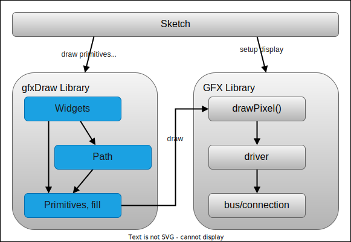

# Drawing Vector Graphics on Arduino GFX displays

Arduino library for drawing vector graphics on displays with GFX support.

Drawing and transforming graphics elements specified by a path of lines, arcs and curves using the svg path notation.
The advanced drawing algorithms that can use GFX libraries as the low-level interface to various displays.

There are various GFX libraries available in the Arduino Community that support many differend displays with simple
graphics can be drawn like lines, rectangles, circles and some more.  The features are limited e.g.  rectangles can only
be drawn without rotation and complex figure drawings are not available at all.

The gfxDraw library overcomes these limitations by offering more advanced drawing capabilities with vectorized drawing
input and a set of high-level classes to draw typical widgets.

The library can be used with almost any GFX library implementation available with examples provided for Adafruit GFX and
the GFX Library for Arduino as the GFX libraries are only used for sending changes to the displays.

In contrast to the rasterization implementations used in Desktop programs or browsers this library is dedicated to
microprocessor circumstances with limited memory and cpu power and avoids arithmetic floating point calculations and
doesn't support anti-aliased drawing.


## Software Architecture

This is a short high level overview on the way how the gfxDraw library is used by sketches or examples, how it works
internally and how the GFX libraries are linked for low level drawing.

The library uses the Namespace `gfxDraw` to implement the types, functions and the classes to avoid conflicts with other libraries.



**Primitives** -- The simple drawing functionality available is covering **lines**, **rectangles**, **arcs**, **circles**, **bezier
curves** and some direct usable combinations like rounded rectangles.  These function "only" calculate the points that
make up the primitive and use callback function to hand them over to further processing or drawing.

**Filling** -- One of the further processing function available is the filling algorithm that can find out what pixels are inside a
closed area and also pass them for further processing or drawing.

**Path** -- For drawings with a more complex border paths with the syntax from svg can be used for defining the border lines. 
Paths can be transformed, resized and rotated. See further details below.

**Widgets** --  The Widget classes offers defining parameters for drawing of complex functionality like **gauges**.


### General Library Implementation Rules

This library aims to support graphics implementations that are used in microprocessors like ESP32 based boards with
pixel oriented graphic displays.

The functions are optimized for low resolution pixel displays. They do not implement antialiasing and have minimized use of float
and arc arithmetics.  

The library supports up to 16 bit (-32760 ... +32760) display resolutions.

By design the drawing functionionality is independent of the color depth.

The Widget Classes and the internal Bitmap Class supports drawing using a 32-bit (or less) color setup using RGB+Alpha
for a specific pixel.

The drawing output can be "plugged" not ony to the GFX library for drawing but some "filters" are available also to
support functionality like saving the output in memory or filling a widget with a gradient.


## Drawing on a display

The easiest way to draw one of the provided primitives.  A helper function for drawing a color at a position is used for
binding the gfxDraw functionality to the display driver:

```cpp
using namespace gfxDraw; // use gfxDraw library namespace

setFillColor(int16_t x, int16_t y) {
  gfx->setPixel(x, y, SILVER);
})
```

A rectagle with no border and a SILVER fill color can be drawn with:

```cpp
// draw a background rectangle
drawRect(8, 8, 60, 40, nullptr, setFillColor);
```

A path can be drawn using

```cpp
// A SVG path defining the shape of a heard
const char *heardPath = "M43 7 a1 1 0 00-36 36l36 36 36-36a1 1 0 00-36-36z";

pathByText(heardPath, 8, 8, 100, nullptr, setFillColor);
```

## Widget classes

The Widget classes offers further functionionality and espacially can handle a fixed color for stroke and fill.

By creating a instance on a class the basic configuration can be passed to the constructor and parameters can be
changed by using methods.

```cpp
using namespace gfxDraw; // use gfxDraw library namespace

// A SVG path defining the shape of a heard
const char *heardPath = "M43 7 a1 1 0 00-36 36l36 36 36-36a1 1 0 00-36-36z";

// use red fill and yellow border color
gfxDraw::gfxDrawPathConfig conf = {
  .strokeColor = gfxDraw::ARGB_YELLOW,
  .fillColor = gfxDraw::ARGB_RED
};

drawCallback(int16_t x, int16_t y, uint32_t color) {
  gfx->setPixel(x, y, color);
})

gfxDraw::gfxDrawPathWidget *heardWidget = new gfxDraw::gfxDrawPathWidget();
heardWidget->setConfig(&conf);
heardWidget->setPath(heardPath);
heardWidget->rotate(45);
heardWidget->move(8, 8);
heardWidget->draw(drawCallback);
```

See [Path Widgets Class](docs/path-widget.md).


## SVG Path Syntax

Drawing using paths is used by some of the widgets to customize e.g. the pointers
for a clock.

To create a vector (array) of segments that build the borders of the vector graphics object the `path` syntax from the
SVG standard is used.  

There are helpful web applications to create or edit such paths definitions:

* The [SVG Path Editor](https://yqnn.github.io/svg-path-editor/) with source available in
  [Github/Yqnn](https://github.com/Yqnn/svg-path-editor) from Yann Armelin

* The [SVG Path Editor](https://aydos.com/svgedit/) with source available in
  [Github/aydos](https://github.com/aydos/svgpath) from Fahri Aydos.

Both tools let you directly change the individual segments of paths and also offer some graphical view or even edit capabilities. You can also use full SVG editors and extract the path from there.

For using paths with pixel oriented displays is is important to use integer based coordinates and scalar values only. Better to use larger numbers as scaling the result down to a smaller size is possible.


Examples for paths are:

* Simple Line: `"M 0,0 L 30,40"`
* Rectange: `"M 10,10 h40 v30 h-40 z"`
* Bezier Curve: `"M16 12c5 0 5 7 0 7"`
* Smiley:  
    `"M12,2h64c4,0 8,4 8,8v48c0,4 -4,8 -8,8h-64c-4,0 -8,-4 -8,-8v-48c0,-4 4,-8 8,-8z"`  
    `"M12,10 h60v20h-60z"`  
    `"M24,36c6,0 12,6 12,12 0,6 -6,12 -12,12-6,0 -12,-6 -12,-12 0,-6 6,-12 12,-12z"`  

More details about the implementation can be found in

[Line Command](docs/line_command.md)
[Bezier Arc Command](docs/bezier_command.md)
[Elliptical Arc Command](docs/elliptical_arc_command.md)
[Filling Paths](docs/filling.md)

Implemented Widgets

[Path Widget](docs/path-widget.md)
[Gauge Widget](docs/gauge-widget.md)


## Contributions

Contributions are welcome. Please use GitHub Issues for discussing and Pull Request. Need more -- just ask.


## The Examples

The examples that come with this library demonstrate on how to use gfxdraw in several situations and project setup.

* using Adafruit GFX
* using the GFX Library for Arduino
* draw primitives
* path drawing and transformation functions

<!-- ### Adafruit GFX Example

This example demonstrates how to use gfxDraw with the
[Adafruit GFX Library](https://github.com/adafruit/Adafruit-GFX-Library) that is on of the most often used GFX libraries
for Arduino. -->


### Moon GFX Example

This example demonstrates how to use gfxDraw with the
[GFX Library for Arduino](https://github.com/moononournation/Arduino_GFX) that has some excellent support for devices
based on the ESP32 chips and graphics displays.


### VSCode PNG Example

In the `examples/png` folder you can find a implementation for using the library by a windows executable to produce
several png files with test images.

This example is especially helpful while engineering the library with fast turn-around cycles and debugging capabilities.


<!-- ### gfxprimitives Example

To draw the paths the primitive functions for drawing lines, arc and curves are part of the library and also can be used directly. -->


<!-- ### gfxsegments Example

After parsing the path syntax a list (vector) of segments is created than can be used for transformations and drawing.

This example shows how to draw using these functions. They are also used by the gfxDrawWidget implementation. -->


## See also

* [Bresenham efficient drawing functions](http://members.chello.at/easyfilter/bresenham.html)
* [Wikipedia Bresenham Algorithm](https://de.wikipedia.org/wiki/Bresenham-Algorithmus)
* [Wikipedia Scanline Rendering](https://en.wikipedia.org/wiki/Scanline_rendering)
* [Math background for using transformation matrixes in 2D drawings](https://www.matheretter.de/wiki/homogene-koordinaten)
* [SVG Game Icons](https://game-icons.net/)
* [SVG IoT Icons](https://github.com/HomeDing/WebFiles/tree/master/i)
